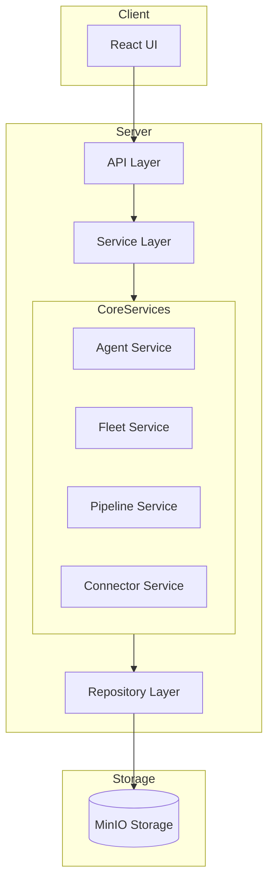
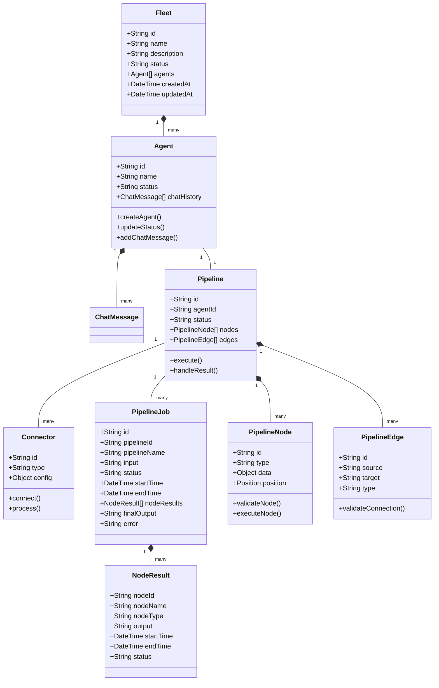
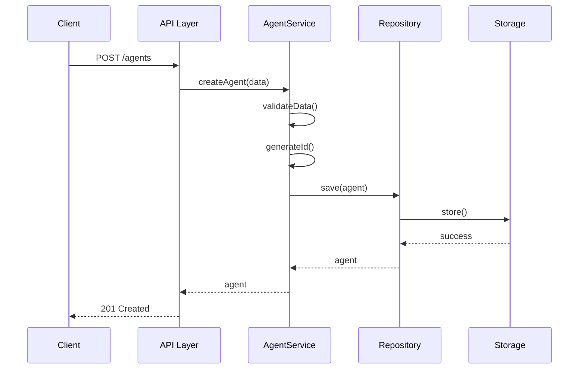
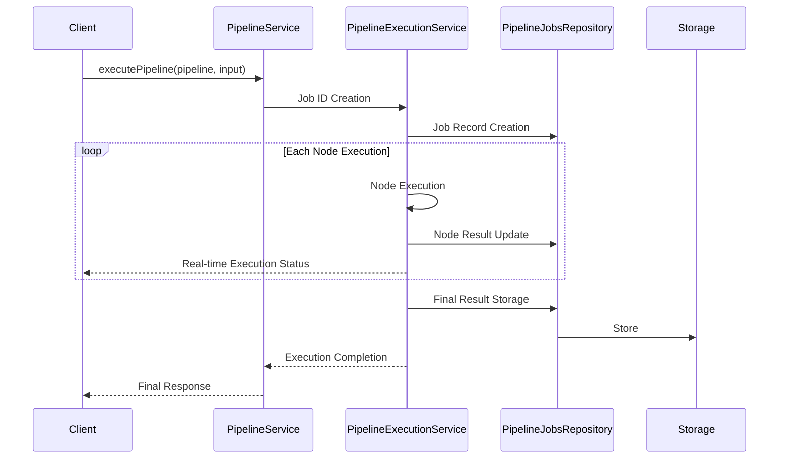
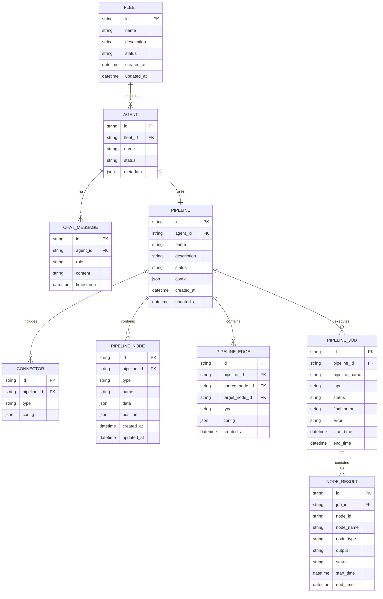

# Agent Fleet Architecture Document

## 1. System Overview

Agent Fleet is a web application based on client-server architecture. The server is implemented using Node.js and Express.js, utilizing object storage (MinIO) for data management.

## 2. Technology Stack

### Server (Backend)

- Runtime: Node.js
- Framework: Express.js
- Language: TypeScript
- Object Storage: MinIO (S3 compatible)

### Client (Frontend)

- React.js based web application

## 3. Server Architecture

### Directory Structure

```
server/
├── src/
│   ├── routes/      # API route definitions
│   ├── services/    # Business logic
│   ├── middleware/  # Express middleware
│   ├── repositories/# Data access layer
│   ├── clients/     # External service clients
│   ├── drivers/     # Storage drivers
│   ├── mocks/       # Test mock data
│   ├── config.ts    # Environment configuration
│   └── index.ts     # Application entry point
```

### Layer Structure

1. **Route Layer**

   - API endpoint definitions
   - Request/Response handling

2. **Service Layer**

   - Business logic implementation
   - Transaction management

3. **Repository Layer**

   - Data access abstraction
   - CRUD operations

4. **Driver Layer**
   - Storage implementations
   - S3 compatible storage integration

### Key Components

1. **Error Handling Middleware**

   - Global error handling
   - HTTP status code management

2. **S3 Repository Driver**

   - MinIO object storage integration
   - File upload/download management

3. **Security**
   - CORS configuration
   - Request validation

## 4. Infrastructure

### Containerization

- Docker-based containerization
- Local development environment through Docker Compose

### Main Containers

1. Server Application
2. Client Application
3. MinIO Object Storage

## 5. Development Environment

### Tools

- TypeScript
- ESLint
- Docker & Docker Compose

### Configuration Files

- `tsconfig.json`: TypeScript configuration
- `docker-compose.yml`: Container configuration
- `.env`: Environment variables

## 6. Business Logic Details

### Core Domain Models

1. **Agent**

   - Domain model representing individual AI agents
   - Properties:
     - id: Unique identifier
     - name: Agent name
     - status: Active status (active/inactive)
     - chatHistory: Conversation history
   - Key Functions:
     - Agent creation/modification/deletion
     - Status management
     - Chat history management

2. **Fleet**

   - High-level concept grouping multiple agents
   - Properties:
     - id: Unique identifier
     - name: Fleet name
     - description: Description
     - agents: List of member agents
     - status: Active status
     - createdAt/updatedAt: Creation/modification times
   - Key Functions:
     - Fleet creation/modification/deletion
     - Agent group management

3. **Pipeline**

   - Agent's reasoning and execution process
   - Components:
     - Connectors: External system integration
     - Reasoning Engine: Agent decision processing
     - Execution Engine: Decided task execution

4. **PipelineJob**
   - Domain model representing pipeline execution instance
   - Properties:
     - id: Job unique identifier
     - pipelineId: Executed pipeline ID
     - pipelineName: Pipeline name
     - input: Input data
     - status: Execution status (running/completed/failed)
     - startTime/endTime: Start/End times
     - nodeResults: Node execution results
     - finalOutput: Final output result
     - error: Error information (if failed)
   - Key Functions:
     - Execution status tracking
     - Node-level result management
     - Execution history querying

### Service Layer Structure

1. **AgentService**

   - Agent lifecycle management
   - Conversation processing and history management
   - Status change management

2. **FleetService**

   - Fleet lifecycle management
   - Agent group management
   - Fleet status monitoring

3. **PipelineExecutionService**

   - Pipeline job execution management
   - Key Functions:
     - Pipeline execution streaming
     - Execution status monitoring
     - Execution record management
     - Node-level result processing

4. **ConnectorService**
   - External system integration
   - API integration
   - Data transformation

### Key Business Processes

1. **Agent Creation and Initialization**

   ```
   1. Validate agent basic information
   2. Generate unique ID
   3. Set initial status (active)
   4. Store agent information in repository
   ```

2. **Fleet Management**

   ```
   1. Fleet creation/modification
   2. Agent assignment/removal
   3. Fleet status update
   4. Metadata management
   ```

3. **Pipeline Execution**

   ```
   1. Pipeline initialization
   2. Connector setup
   3. Reasoning process execution
   4. Result processing and storage
   ```

4. **Pipeline Job Processing**
   ```
   Request → Job Creation →
   Sequential Node Execution → Real-time Status Updates →
   Result Storage → Completion Notification
   ```

### Data Flow

1. **Agent Task Processing**

   ```
   User Request → API Router → AgentService →
   Pipeline Execution → Connector Processing →
   Result Storage → Response
   ```

2. **Fleet Task Processing**

   ```
   Fleet Request → FleetService →
   Individual Agent Processing →
   Result Aggregation → Response
   ```

3. **Pipeline Job Processing**
   ```
   Execution Request → Job Creation →
   Sequential Node Execution → Real-time Status Updates →
   Result Storage → Completion Notification
   ```

### Error Handling

1. **Validation Errors**

   - Missing required fields
   - Invalid data format
   - Status value validation

2. **Business Rule Violations**

   - Duplicate agent/fleet creation
   - Invalid state transitions
   - Permission violations

3. **System Errors**

   - Storage connection failure
   - External service communication failure
   - Resource exhaustion

4. **Execution Errors**
   - Node execution failure
   - Timeout
   - Resource limit exceeded

## 7. System Diagram

### System Architecture Diagram



### Domain Model Relationship Diagram



### Business Process Flow Diagram

1. **Agent Creation Process**



2. **Pipeline Execution Process**



### Data Storage Structure


