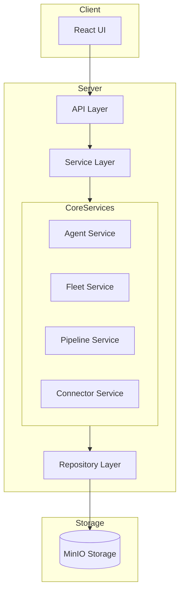
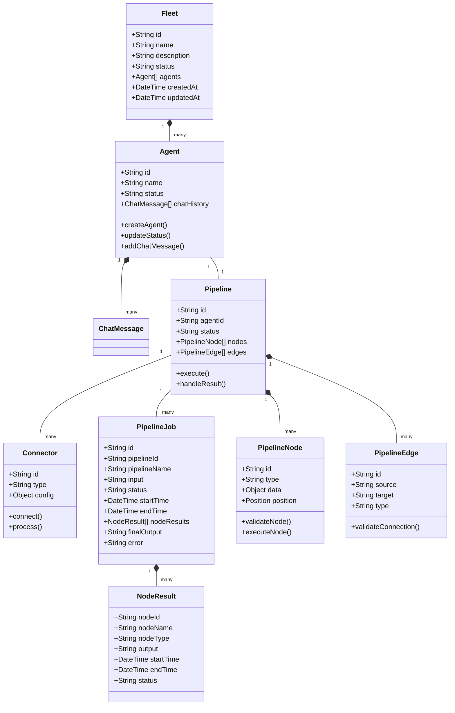
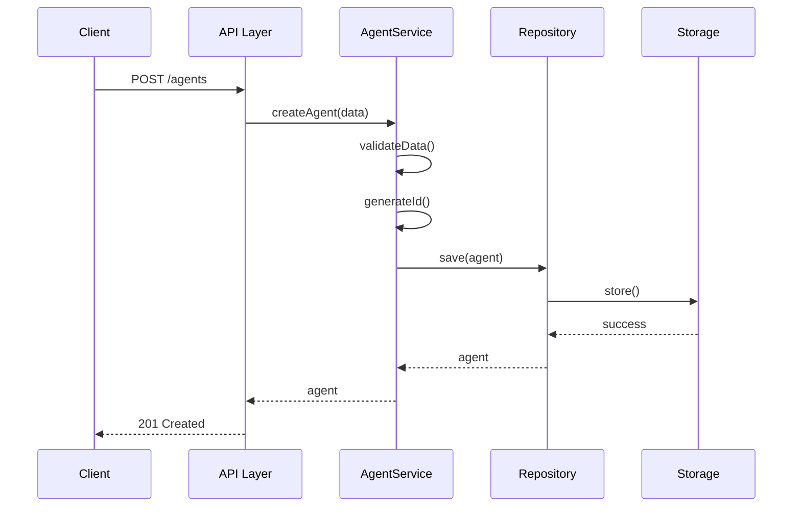
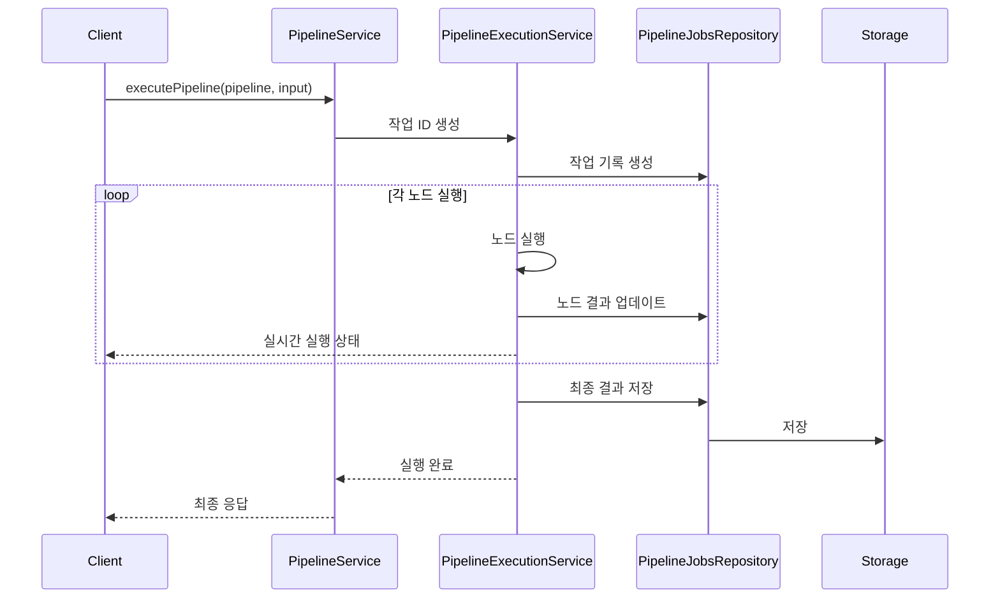
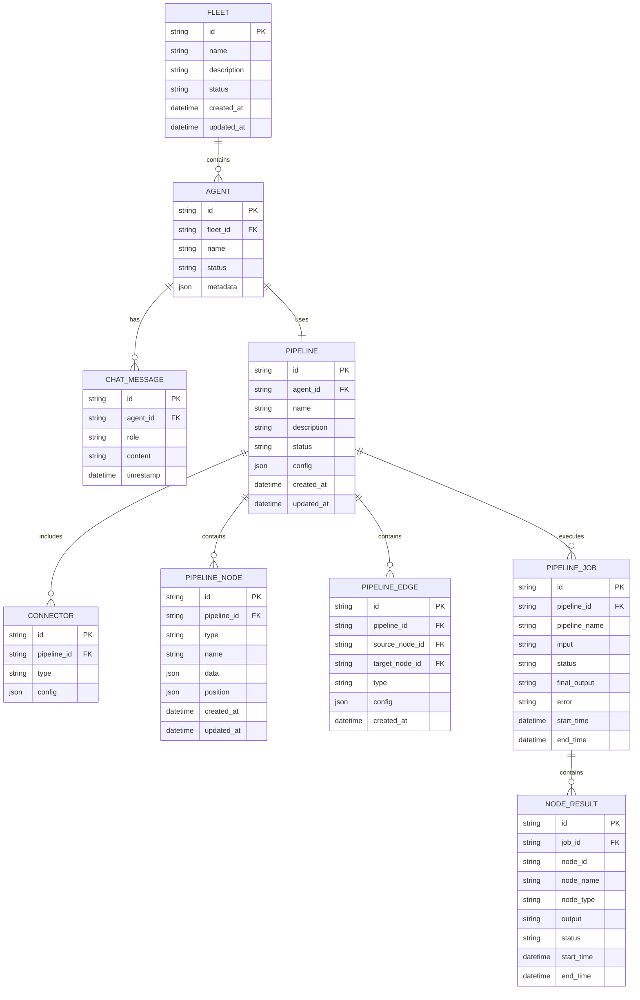

# Agent Fleet 아키텍처 문서

## 1. 시스템 개요

Agent Fleet은 클라이언트-서버 아키텍처를 기반으로 하는 웹 애플리케이션입니다. 서버는 Node.js와 Express.js를 사용하여 구현되었으며, 객체 스토리지(MinIO)를 활용하여 데이터를 관리합니다.

## 2. 기술 스택

### 서버 (Backend)

- Runtime: Node.js
- 프레임워크: Express.js
- 언어: TypeScript
- 객체 스토리지: MinIO (S3 호환)

### 클라이언트 (Frontend)

- React.js 기반의 웹 애플리케이션

## 3. 서버 아키텍처

### 디렉토리 구조

```
server/
├── src/
│   ├── routes/      # API 라우트 정의
│   ├── services/    # 비즈니스 로직
│   ├── middleware/  # Express 미들웨어
│   ├── repositories/# 데이터 접근 계층
│   ├── clients/     # 외부 서비스 클라이언트
│   ├── drivers/     # 저장소 드라이버
│   ├── mocks/       # 테스트용 목 데이터
│   ├── config.ts    # 환경 설정
│   └── index.ts     # 애플리케이션 엔트리포인트
```

### 계층 구조

1. **라우트 계층 (Routes)**

- API 엔드포인트 정의
- 요청/응답 처리

2. **서비스 계층 (Services)**

- 비즈니스 로직 구현
- 트랜잭션 관리

3. **리포지토리 계층 (Repositories)**

- 데이터 접근 추상화
- CRUD 작업 처리

4. **드라이버 계층 (Drivers)**

- 저장소 구현체
- S3 호환 스토리지 연동

### 주요 컴포넌트

1. **에러 처리 미들웨어**

- 전역 에러 핸들링
- HTTP 상태 코드 관리

2. **S3 리포지토리 드라이버**

- MinIO 객체 스토리지 연동
- 파일 업로드/다운로드 관리

3. **보안**

- CORS 설정
- 요청 검증

## 4. 인프라 구조

### 컨테이너화

- Docker 기반 컨테이너화
- Docker Compose를 통한 로컬 개발 환경 구성

### 주요 컨테이너

1. 서버 애플리케이션
2. 클라이언트 애플리케이션
3. MinIO 객체 스토리지

## 5. 개발 환경

### 도구

- TypeScript
- ESLint
- Docker & Docker Compose

### 설정 파일

- `tsconfig.json`: TypeScript 설정
- `docker-compose.yml`: 컨테이너 구성
- `.env`: 환경 변수

## 6. 비즈니스 로직 상세

### 핵심 도메인 모델

1. **Agent (에이전트)**

- 개별 AI 에이전트를 나타내는 도메인 모델
- 속성:
  - id: 고유 식별자
  - name: 에이전트 이름
  - status: 활성 상태 (active/inactive)
  - chatHistory: 대화 이력
- 주요 기능:
  - 에이전트 생성/수정/삭제
  - 상태 관리
  - 대화 이력 관리

2. **Fleet (플릿)**

- 여러 에이전트를 그룹화하는 상위 개념
- 속성:
  - id: 고유 식별자
  - name: 플릿 이름
  - description: 설명
  - agents: 소속 에이전트 목록
  - status: 활성 상태
  - createdAt/updatedAt: 생성/수정 시간
- 주요 기능:
  - 플릿 생성/수정/삭제
  - 에이전트 그룹 관리

3. **Pipeline (파이프라인)**

- 에이전트의 추론 및 실행 프로세스
- 구성 요소:
  - 커넥터: 외부 시스템과의 연동
  - 추론 엔진: 에이전트의 의사결정 처리
  - 실행 엔진: 결정된 작업 수행

4. **PipelineJob (파이프라인 작업)**
   - 파이프라인의 실행 인스턴스를 나타내는 도메인 모델
   - 속성:
     - id: 작업 고유 식별자
     - pipelineId: 실행된 파이프라인 ID
     - pipelineName: 파이프라인 이름
     - input: 입력 데이터
     - status: 실행 상태 (running/completed/failed)
     - startTime/endTime: 시작/종료 시간
     - nodeResults: 각 노드의 실행 결과
     - finalOutput: 최종 출력 결과
     - error: 오류 정보 (실패 시)
   - 주요 기능:
     - 실행 상태 추적
     - 노드별 실행 결과 관리
     - 실행 이력 조회

### 서비스 계층 구조

1. **AgentService**

- 에이전트 생명주기 관리
- 대화 처리 및 이력 관리
- 상태 변경 관리

2. **FleetService**

- 플릿 생명주기 관리
- 에이전트 그룹 관리
- 플릿 상태 모니터링

3. **PipelineExecutionService**

- 파이프라인 작업 실행 관리
- 주요 기능:
  - 파이프라인 실행 스트리밍
  - 실행 상태 모니터링
  - 실행 기록 관리
  - 노드별 실행 결과 처리

4. **ConnectorService**

- 외부 시스템 연동
- API 통합
- 데이터 변환

### 주요 비즈니스 프로세스

1. **에이전트 생성 및 초기화**

```
1. 에이전트 기본 정보 검증
2. 고유 ID 생성
3. 초기 상태 설정 (active)
4. 저장소에 에이전트 정보 저장
```

2. **플릿 관리**

```
1. 플릿 생성/수정
2. 에이전트 할당/제거
3. 플릿 상태 업데이트
4. 메타데이터 관리
```

3. **파이프라인 실행**

```
1. 파이프라인 초기화
2. 커넥터 설정
3. 추론 프로세스 실행
4. 결과 처리 및 저장
```

4. **파이프라인 작업 처리**
   ```
   실행 요청 → 작업 생성 →
   노드별 순차 실행 → 실시간 상태 전송 →
   결과 저장 → 완료 통지
   ```

### 데이터 흐름

1. **에이전트 작업 처리**

```
User Request → API 라우터 → AgentService →
Pipeline 실행 → Connector 처리 →
결과 저장 → Response
```

2. **플릿 작업 처리**

```
Fleet 요청 → FleetService →
개별 에이전트 처리 →
결과 집계 → Response
```

3. **파이프라인 작업 처리**
   ```
   실행 요청 → 작업 생성 →
   노드별 순차 실행 → 실시간 상태 전송 →
   결과 저장 → 완료 통지
   ```

### 오류 처리

1. **검증 오류**

- 필수 필드 누락
- 잘못된 형식의 데이터
- 상태 값 검증

2. **비즈니스 규칙 위반**

- 중복된 에이전트/플릿 생성
- 잘못된 상태 전이
- 권한 위반

3. **시스템 오류**

- 저장소 연결 실패
- 외부 서비스 통신 오류
- 리소스 부족

4. **실행 오류**
   - 노드 실행 실패
   - 타임아웃
   - 리소스 제한 초과

## 7. 시스템 다이어그램

### 시스템 아키텍처 다이어그램



### 도메인 모델 관계도



### 비즈니스 프로세스 흐름도

1. **에이전트 생성 프로세스**



2. **파이프라인 실행 프로세스**



### 데이터 저장소 구조


